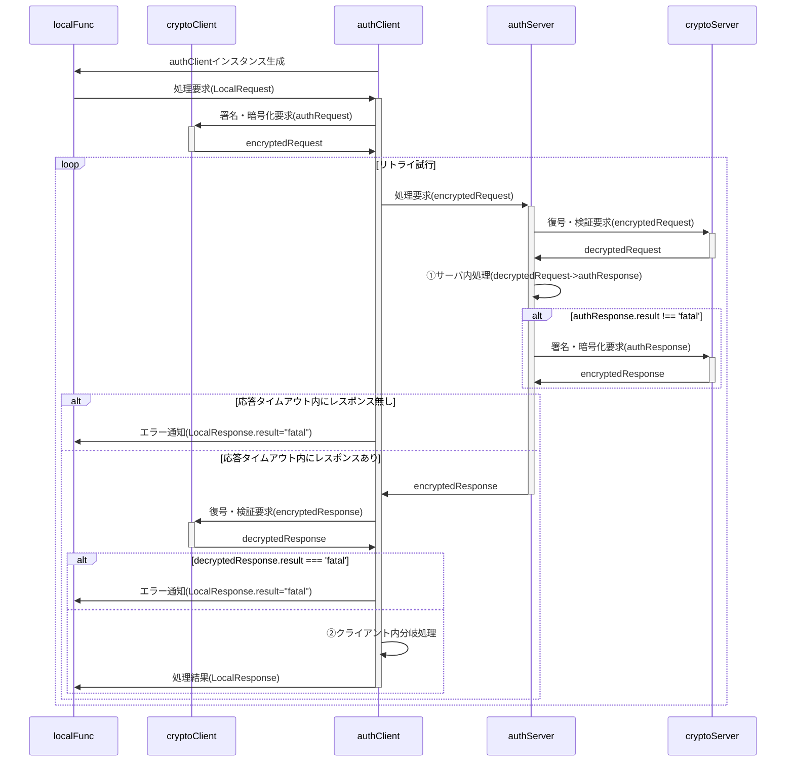

# 総説

ブラウザ(クライアント)とGAS(サーバ)の間で認証された通信を行う。

関連仕様書：[authClient](doc/authClient.md) | [authServer](doc/authServer.md) | [Member](doc/Member.md) | [cryptoServer](doc/cryptoServer.md) | [cryptoClient](doc/cryptoClient.md)

## 要求仕様

- 本システムは限られた人数のサークルや小学校のイベント等での利用を想定する。 
  よってセキュリティ上の脅威は極力排除するが、恒久性・安全性より導入時の容易さ・技術的ハードルの低さ、運用の簡便性を重視する。
- サーバ側(以下authServer)はスプレッドシートのコンテナバインドスクリプト、クライアント側(以下authClient)はHTMLのJavaScript
- サーバ側・クライアント側とも鍵ペアを使用
- 原則として通信は受信側公開鍵で暗号化＋発信側秘密鍵で署名
- クライアントの識別(ID)はメールアドレスで行う

## 用語

- SPkey, SSkey：サーバ側の公開鍵(Server side Public key)と秘密鍵(Server side Secret key)
- CPkey, CSkey：クライアント側の公開鍵(Client side Public key)と秘密鍵(Client side Secret key)
- パスフレーズ：クライアント側鍵ペア作成時のキー文字列。JavaScriptで自動的に生成
- パスワード：運用時、クライアント(人間)がブラウザ上で入力する本人確認用の文字列
- パスコード：二段階認証実行時、サーバからクライアントに送られる6桁※の数字 
  ※既定値。実際の桁数はauthConfig.trial.passcodeLengthで規定

## 暗号化・署名方式、運用

- 署名方式 : RSA-PSS
- 暗号化方式 : RSA-OAEP
- ハッシュ関数 : SHA-256以上
- 許容時差±120秒※以内
  ※既定値。実際の桁数はauthConfig.cryptoServer.allowableTimeDifferenceで規定
- 順序は「暗号化->署名」ではなく「署名->暗号化」で行う
  1. クライアントがデータをJSON化
  2. 自身の秘密鍵で署名（署名→暗号化）
  3. サーバの公開鍵で暗号化
  4. サーバは復号後、クライアント公開鍵(memberList.CPkey)で署名を検証
- パスワードの生成は「ライブラリ > createPassword」を使用
- パスコードのメール送信は「ライブラリ > sendMail」を使用
- CPkeyの有効期限が切れた場合、以下の手順で更新する
  1. クライアント側から古いCPkeyで署名された要求を受信
  2. サーバ側で署名検証の結果、期限切れを確認
    - memberList.trial[0].CPkeyUpdateUntilに「現在日時＋authConfig.cryptoServer.loginLifeTime」をセット
    - クライアント側に通知
  3. クライアント側でCPkeyを更新、新CPkeyで再度リクエスト
  4. サーバ側でauthConfig.cryptoServer.loginLifeTimeを確認、期限内ならmemberList.CPkeyを書き換え。期限切れなら加入処理同様、adminによる個別承認を必要とする。
  5. 以降は未ログイン状態で要求が来た場合として処理を継続

# 処理手順

## localFuncからの処理要求時

- `localFunc`とは、クライアント側(ブラウザ)内で動作するJavaScriptの関数を指す
- ①サーバ内処理：decryptedRequestを入力としてメイン処理またはメソッドを実行
- ②クライアント内分岐処理：decryptedResponse.sv.resultに基づきメイン処理またはメソッドを実行
- 「リトライ試行」は以下の場合にループを抜ける
  - 応答タイムアウト内にauthServerからレスポンスが来なかった場合 
    ※`fetch timeout`を使用。許容時間は`authConfig.allowableTimeDifference`
  - ②クライアント内分岐処理の結果が'fatal'だった場合

# データ格納方法と形式

- 日時は特段の注記が無い限り、UNIX時刻でミリ秒単位で記録する(new Date().getTime())
- スプレッドシート(memberList)については[Memberクラス仕様書](Member.md)参照

# 動作設定変数(config)

## authConfig

<!--::$tmp/authConfig.md::-->

## authServerConfig

<!--::$tmp/authServerConfig.md::-->

## authClientConfig

<!--::$tmp/authClientConfig.md::-->

# データ型(typedef)

## LocalRequest

<!--::$tmp/LocalRequest.md::-->

## authRequest

<!--::$tmp/authRequest.md::-->

## encryptedRequest

<!--::$tmp/encryptedRequest.md::-->

## decryptedRequest

<!--::$tmp/decryptedRequest.md::-->

## authResponse

<!--::$tmp/authResponse.md::-->

## encryptedResponse

<!--::$tmp/encryptedResponse.md::-->

## decryptedResponse

<!--::$tmp/decryptedResponse.md::-->

## LocalResponse

<!--::$tmp/LocalResponse.md::-->

# クラス・関数定義

- [authClient](doc/authClient.md) 関数 仕様書
- [authServer](doc/authServer.md) 関数 仕様書
- [Member](doc/Member.md) クラス 仕様書
- [cryptoServer](doc/cryptoServer.md) 関数 仕様書
- [cryptoClient](doc/cryptoClient.md) 関数 仕様書
