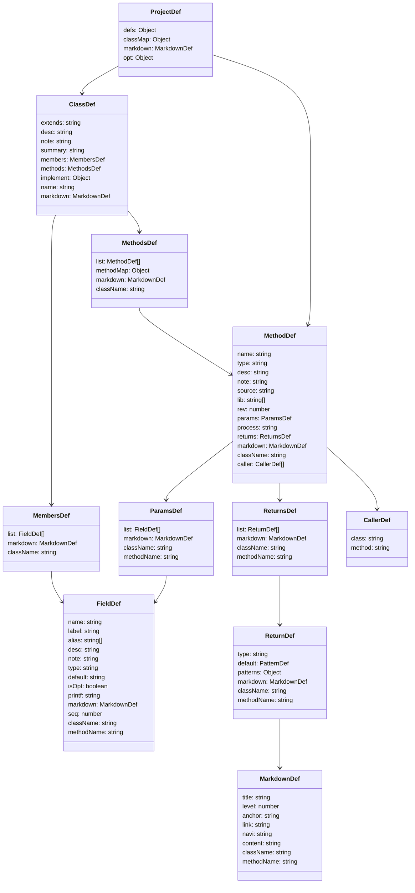

```mermaid
classDiagram
class ProjectDef {
  defs: Object<string,ClassDef|MethodDef>
  classMap: Object<string,string>
  markdown: MarkdownDef
  opt: Object
}
class ClassDef {
  extends: string
  desc: string
  note: string
  summary: string
  members: MembersDef
  methods: MethodsDef
  implement: Object<string,boolean>
  name: string
  markdown: MarkdownDef
}
class MembersDef {
  list: FieldDef[]
  markdown: MarkdownDef
  className: string
}
class FieldDef {
  name: string
  label: string
  alias: string[]
  desc: string
  note: string
  type: string
  default: string
  isOpt: boolean
  printf: string
  markdown: MarkdownDef
  seq: number
  className: string
  methodName: string
}
class MethodsDef {
  list: MethodDef[]
  methodMap: Object
  markdown: MarkdownDef
  className: string
}
class MethodDef {
  name: string
  type: string
  desc: string
  note: string
  source: string
  lib: string[]
  rev: number
  params: ParamsDef
  process: string
  returns: ReturnsDef
  markdown: MarkdownDef
  className: string
  caller: CallerDef[]
}
class CallerDef {
  class: string
  method: string
}
class ParamsDef {
  list: FieldDef[]
  markdown: MarkdownDef
  className: string
  methodName: string
}
class ReturnsDef {
  list: ReturnDef[]
  markdown: MarkdownDef
  className: string
  methodName: string
}
class ReturnDef {
  type: string
  default: PatternDef
  patterns: Object<string,PatternDef>
  markdown: MarkdownDef
  className: string
  methodName: string
}
class MarkdownDef {
  title: string
  level: number
  anchor: string
  link: string
  navi: string
  content: string
  className: string
  methodName: string
}

ProjectDef --> ClassDef
ProjectDef --> MethodDef
ClassDef --> MembersDef
ClassDef --> MethodsDef
MembersDef --> FieldDef
MethodsDef --> MethodDef
MethodDef --> ParamsDef
MethodDef --> ReturnsDef
MethodDef --> CallerDef
ParamsDef --> FieldDef
ReturnsDef --> ReturnDef
ReturnDef --> MarkdownDef
```
