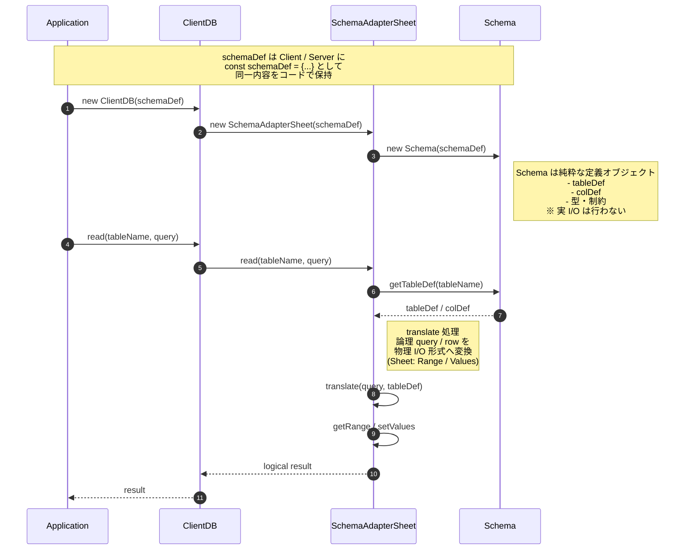

# Schema/Adapter/DBの役割分担

- Schema
	- 呼ばれるだけの存在
	- 自身では外部（DB / Sheet / SQL）を一切知らない
	- 構造・制約・型の「事実」だけを保持
- SchemaAdapter
	- Schema を 解釈する主体
	- translate（論理 → 物理）を一手に担う
	- DB実装（Sheet / SQL / IndexedDB）に依存してよい
- DB（ClientDB / ServerDB）
	- Application から見える 唯一の窓口
	- Adapter を内部に隠蔽
	- Schema の中身は直接触らない
- Application
	- Adapter / Schema の存在を意識しない
	- DB API のみを使用（Single Window）