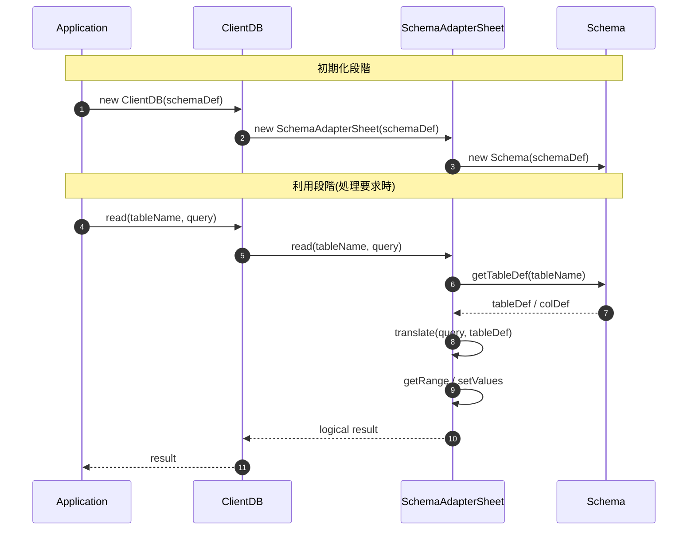

# Schema/Adapter/DBの役割分担

前提：

- 図中の矢印はI/Oではなく、参照・被参照関係を示す
- 構造定義情報は`const schemaDef={...}`として、クライアント・サーバ両方のソースに同一内容を埋め込む

- Schema：純粋な定義オブジェクト
  - テーブル定義(tableDef)・項目定義(columnDef)およびその間の関係性を定義
	- 呼ばれるだけの存在
	- 自身では外部（DB / Sheet / SQL）を一切知らない(⇒実I/Oは一切行わない)
	- 構造・制約・型の「事実」だけを保持
- SchemaAdapter
	- Schema を 解釈する主体
	- translate（論理 → 物理）を一手に担う 
    query/rowの論理形式情報を物理I/O形式へ変換(ex. getRange/setValues)
	- DB実装（Sheet / SQL / IndexedDB）に依存してよい
- DB（ClientDB / ServerDB）
	- Application から見える 唯一の窓口
	- Adapter を内部に隠蔽
	- Schema の中身は直接触らない
- Application
	- Adapter / Schema の存在を意識しない
	- DB API のみを使用（Single Window）